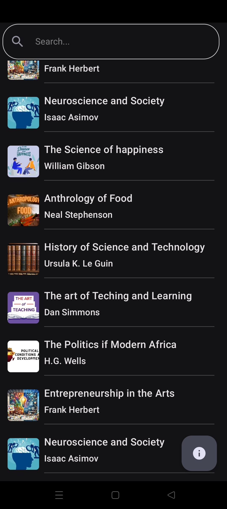
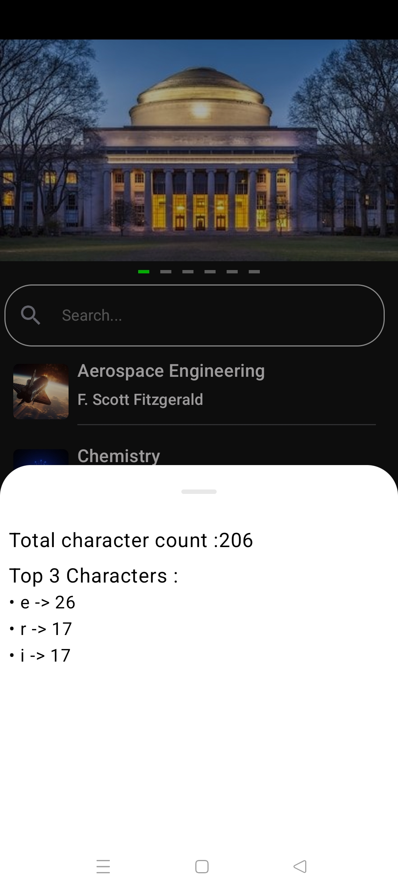

# University Courses App

## Overview
The University Courses App showcases university details and their offered courses, along with the professors teaching those courses. The app provides an interactive carousel for university images, a search field for dynamic filtering, and a detailed list of courses.

## Features

1. **Splash Screen API:** Modern splash screen implementation for a seamless startup experience.
2. **Carousel** for University Images: Display a rotating carousel of images for each university.
3. **Dynamic** Search: Search functionality that updates results with each character entered.
4. **Course List:** View a list of courses offered by universities, including professor details.
5. **Bottom Sheet Statistics:**
- Display the top three most frequent characters.
- Show the total character count.

## Architecture
The application follows Clean Architecture principles with a multimodule structure to ensure scalability and maintainability.
### Key Modules
**App Module:** Entry point of the application.
**Data Module:** Handles data sources and repositories.
**Domain Module:** Contains use cases and business logic.
**Presentation Module:** Manages UI with MVVM architecture.

## How to Use

**Card Browsing**
- Explore a list of available cards categorized by their University Courses.

**Comparing Courses**
- List shows details of the courses like course name and professor name.

**Search Functionality**
- Use the search bar to find relevant course quickly.

## Installation

1. Clone the repository:
`git clone https://github.com/your-username/university-courses-app.git`
2. Open the project in Android Studio.
3. Sync the Gradle files.
4. Build and run the app on an emulator or physical device.

## Screenshots

---